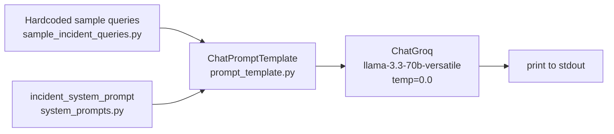
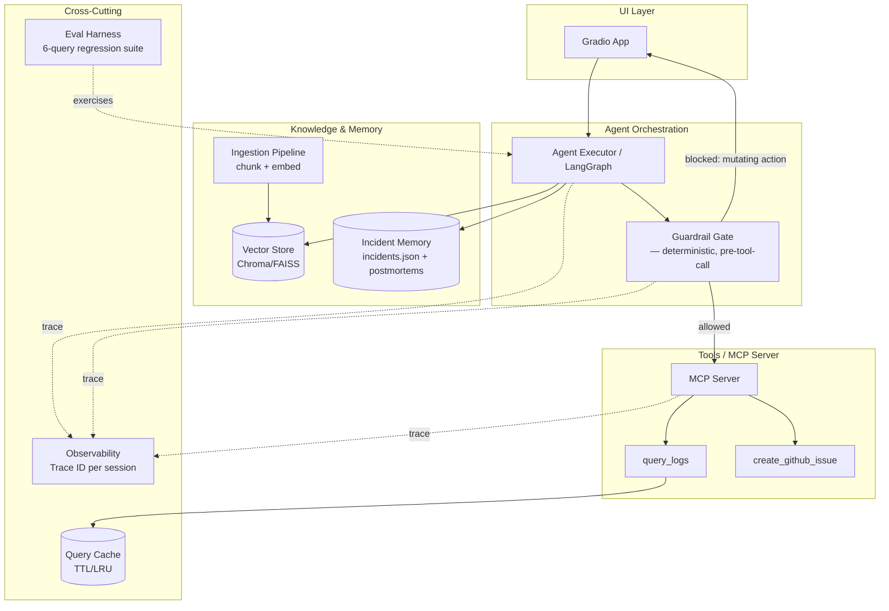
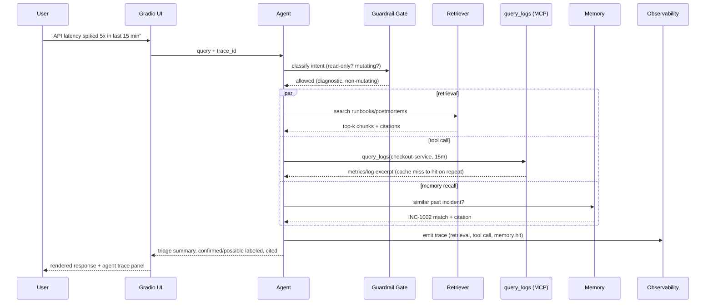

# IncidentPilot — Current Project Working Structure Design

**Type:** High-Level Design (HLD) — As-Is assessment and To-Be target architecture
**Last updated:** 2026-07-15
**Status:** For review — no implementation started as a result of this document
**Scope:** (A) As-Is assessment of the repository at the time of writing, (B) To-Be target architecture, (C) gap analysis and staffed recommendation per open decision

---

## A. As-Is: What Actually Exists Today

The docs (`tasks.md`, `README.md`) describe a 4-week, 32-task plan. Cross-checking against the actual code, **the repo is at the end of Week-1/Task-3, plus data assets from Task 4-5 — nothing past that is wired up yet**, despite the README's project tree implying more (`src/utils/`, `src/data/logs/` are documented but don't exist on disk).

### A.1 What's actually running

That's the entire runtime today: `main.py` loops over 6 hardcoded queries, runs each through a LangChain `ChatPromptTemplate → ChatGroq` chain, and prints the response. There is:

- **No retrieval.** The RAG corpus (5 runbooks, 3 postmortems, 2 code docs — all well-written and mapped to the 6 sample queries in `sources.md`) exists as flat Markdown files but is **not chunked, embedded, or queried anywhere in the code.** The system prompt tells the model to say "confirmed" vs "possible" and never fabricate — but nothing actually grounds it. Today this is a **bare LLM call with a well-written prompt**, not a RAG system.
- **No tools.** `query_logs` and `create_github_issue` are specified only in prose (`requirements.md`, `tasks.md`) — no tool code, no MCP server.
- **No memory.** `incidents.json` exists as data but nothing reads it at query time.
- **No enforced guardrails.** The "never execute a rollback" rule lives entirely in the system prompt text. There is no code path that could execute a mutating action in the first place, and no deterministic check — the guardrail is currently 100% trust-the-LLM.
- **No UI.** Gradio is named in the stack table but isn't a dependency in `pyproject.toml` and isn't imported anywhere.
- **No caching, no observability, no eval harness.** All Week 3/4 scope.

### A.2 Component inventory (as-is)

| Component | State | Notes |
|---|---|---|
| Entry point (`main.py`) | Working | Console-only, hardcoded query list, no CLI/UI |
| System prompt (`system_prompts.py`) | Working, well-designed | Good separation of confirmed/possible; guardrail language present but unenforced |
| Prompt template (`prompt_template.py`) | Working | Simple LangChain `ChatPromptTemplate` |
| LLM config (`llm_config.py`) | Working | Hardcoded default model `llama-3.3-70b-versatile`, temp 0.0, Groq only |
| RAG corpus | Content exists, pipeline missing | 10 docs, well-scoped, mapped 1:1 to the 6 sample queries |
| Synthetic incident/metrics data | Content exists, pipeline missing | `incidents.json`, 2 metrics CSVs; `logs/` referenced but absent |
| Tools / MCP | Not started | Spec-only |
| Memory | Not started | Data exists, no retrieval logic |
| Guardrail enforcement | Prompt-only | No deterministic/code-level gate |
| Caching | Not started | |
| Observability | Not started | |
| UI | Not started | Gradio not even a dependency yet |
| Tests / CI | None | No test files, no workflow files anywhere in repo |
| Secrets handling | `.env` + `python-dotenv`, single `GROQ_API_KEY` | Fine for a demo; flagged in §C for anything beyond that |

### A.3 Risks in the current state worth flagging now

1. **The guardrail is not real yet.** Everything in `requirements.md` §5 and the system prompt ("must never execute...") is currently just instructions to the model, with no code that would stop it even if it tried — because there's no tool-calling loop at all yet. This becomes a real architectural requirement the moment Week 2 tools are wired in (§B.4).
2. **RAG-grounding claims in the system prompt are currently unbacked.** The prompt tells the model to label facts "confirmed," but with no retriever attached, "confirmed" today just means "the model asserted it" — worth being deliberate about not demoing this prompt alone as if it were already grounded.
3. **Stack table has five "TBD" rows** (Framework, Memory, MCP, Guardrails, Caching, Observability) that block a lot of downstream design decisions — this is the main thing to get a decision on before writing any code (§C).

---

## B. To-Be: Target Architecture

Two honest lenses, because they lead to different answers:

- **Lens 1 — "finish the 4-week build plan as scoped."** This is a cohort/team project with a fixed `tasks.md`, graded on demo-ability (live Gradio UI, screenshots, transcripts). Optimize for: fastest path to a working, demoable, correctly-scoped system: single process, local vector store, LangSmith-style tracing, no infra work.
- **Lens 2 — "how would this actually be run in an enterprise."** Different concerns entirely: multi-tenant secrets, deterministic guardrails audited by a compliance/SRE org, horizontally scalable retrieval, SLA-backed observability, CI-gated evals before any prompt/model change ships.

Recommendation: **build to Lens 1, but make every choice in a way that doesn't foreclose Lens 2** — i.e., no shortcuts that would have to be ripped out later (e.g., don't hardcode guardrail logic inline in the LLM call; don't skip the MCP layer just because direct function-calling would be faster for a demo, since `tasks.md` Task 13 explicitly requires it and it's also the right enterprise pattern for tool exposure). Details below flag where the two lenses diverge.

### B.1 Target system diagram (Lens 1, enterprise-shaped)

### B.2 Query flow (sequence) — Sample Query #1: "latency spiked 5x"

### B.3 Layer-by-layer target design

**1. UI — Gradio** (per existing stack decision, not contested)
Single-page app: query box, response pane, expandable "agent trace" panel (Task 16), guardrail/cache badges (Task 23). Lens-2 note: in a real enterprise deployment this would sit behind SSO and the UI process would be separate from the agent backend for independent scaling — out of scope here, worth one sentence in the demo script, not worth building.

**2. Orchestration — recommend LangGraph over a plain LangChain chain**
The current `main.py` uses a linear `prompt | llm` chain. The moment tools + guardrails + memory enter (Week 2-3), you need branching, conditional tool-calling, and an interrupt point before mutating actions — that's what LangGraph's graph/state-machine model is for, and it composes cleanly with a guardrail node sitting *between* the agent's decision and tool execution (see B.4). Staying on raw LangChain chains would work but you'd hand-roll the same control flow LangGraph gives you for free, and you already depend on `langchain-core`/`langchain-groq`, so the migration cost is low.

**3. RAG / Knowledge — Chroma (local, embedded)**
Of the three named options (Chroma/FAISS/Qdrant), Chroma is the right pick for this project specifically: zero infra (embedded, no server to run), first-class LangChain integration, and metadata filtering is exactly what you need to keep runbooks/postmortems/code_docs queryable both together and separately. FAISS has no native metadata filtering (you'd hand-roll it); Qdrant is the right choice only if you needed a standalone server for multi-client access, which this project doesn't. Reassess only if Lens 2 becomes real.

**4. Guardrails — must move from prompt-text to a deterministic gate**
This is the most important architectural decision in the whole design: **do not rely on the LLM to refuse mutating actions by instruction alone.** Two-layer design:
- *Layer 1 (deterministic):* every tool the agent can call is tagged `read-only` or `mutating` in its MCP schema. The guardrail gate is a plain code check — if the agent's proposed action maps to a mutating tool (deploy/rollback/hotfix), it is blocked *before* execution, unconditionally, no LLM judgment involved.
- *Layer 2 (LLM-assisted):* for softer cases (severity escalation threshold, "is this asking me to fabricate data"), the LLM's own reasoning + the system prompt's confirmed/possible convention is the second layer.
Reason this matters: an LLM-only guardrail is exactly what the Stretch Goal red-team task (`tasks.md` bottom) is designed to break with urgency-framing prompts. A code-level gate that never invokes an LLM decision for the "is this a rollback" question is what actually survives that test, and it's also the only version of this that would pass an enterprise security review — "we told the model not to" is not an acceptable control in any org this kind of system would need to pass audit in.

**5. Tools / MCP — build the two tools as real MCP server endpoints, not inline functions**
`tasks.md` Task 13 already requires this, and it's the right call independent of the assignment: MCP gives you tool-schema-level typing (inputs/outputs/error cases per Task 10), a clean seam for the guardrail tagging in point 4, and — if this ever needed a second agent or client — reusability without rewriting tool logic. Keep `query_logs` reading from the synthetic CSVs/logs (once `src/data/logs/` actually exists — currently missing, see A.3), and `create_github_issue` pointed at a sandbox repo per the stated constraint, never production.

**6. Memory — reuse the vector store, don't stand up a second database**
`incidents.json` + the postmortems already live in the same corpus conceptually. Recommend embedding postmortems into the same Chroma store with a `doc_type: postmortem` metadata field, and using `incidents.json` as the structured lookup for exact-match fields (service, date, resolution) rather than a separate memory DB. A second dedicated memory store would be over-engineering for 3 synthetic incidents — revisit only if the incident corpus grows to a size where structured queries (by service/date range) become a real access pattern.

**7. Caching — simple in-process TTL/LRU cache for the demo**
Task 20/21 only requires demonstrating a cache hit and a latency delta on repeated `query_logs` calls. An in-memory `functools.lru_cache`-style layer keyed on `(service, timeframe)` is sufficient and demoable. Lens-2 note: a real deployment would use Redis for cross-instance cache sharing — one sentence in the demo script, not worth building here.

**8. Observability — LangSmith for the demo, note the enterprise migration path**
Given the 4-week timeline, LangSmith (drop-in with LangChain/LangGraph, gives you trace IDs, per-step timing, and a dashboard almost for free) is the fastest path to Task 24's "every event shares a trace ID" requirement. Lens-2 note: an enterprise SRE org would want this on OpenTelemetry feeding their existing Grafana/Datadog stack instead of a vendor-specific tool — worth naming as the migration path in the demo script, not worth building both.

**9. Eval harness — plain pytest-style scorer over the 6-query table**
Task 25 wants automated pass/fail against `requirements.md` §3. A small script that runs each query through the full pipeline and scores against expected-behavior assertions (tool called? citation present? refusal triggered where required?) is enough — no need for a heavier eval framework at this scale.

### B.4 Target component inventory / decision table

| Area (from README stack table) | Current | Recommendation | Why |
|---|---|---|---|
| Framework | — (raw chain) | **LangGraph** | Native support for branching + guardrail interrupt before tool calls |
| RAG / Vector Store | — | **Chroma** (of the 3 listed) | Zero infra, metadata filtering, LangChain-native |
| Memory | TBD | **Reuse Chroma + `incidents.json` lookup** | Avoid a second DB for 3 synthetic records |
| MCP / Tools | TBD | **Real MCP server**, tools tagged read-only/mutating | Required by Task 13; tagging is what makes the guardrail deterministic |
| Guardrails | Prompt-only | **Code-level deterministic gate + LLM-assisted soft layer** | Prompt-only guardrails fail the red-team stretch goal and any real audit |
| Caching | TBD | **In-process TTL/LRU** | Sufficient for Task 20/21's scope |
| Observability | TBD | **LangSmith** (name OTel as the enterprise path) | Fastest to a working trace dashboard in-timeline |

---

## C. Immediate Gaps to Resolve Before Any Code

1. `src/data/logs/` and `src/utils/` are documented in the README but don't exist — needs either creation (Task 4 follow-up) or a README correction.
2. `pyproject.toml` has no `gradio`, no vector-store, no MCP, no eval dependencies yet — first real code step (Task 6+) will need a dependency pass.
3. Five stack rows are still "TBD" and gate a lot of design — recommendations are given above; explicit sign-off is needed on **Framework (LangGraph)** and **Guardrail approach (deterministic gate)** specifically before anything else, since those two decisions shape every component built after them.

---

**Next step:** confirm, adjust, or override each recommendation in §B.4, and confirm which `tasks.md` task number to start executing against. No code is written until that's confirmed.
